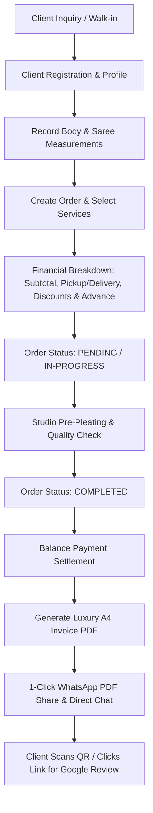

# Aparna Saree Pre-Pleating Studio — Web & Android Application

[](https://react.dev/)
[](https://vitejs.dev/)
[](https://capacitorjs.com/)
[](https://firebase.google.com/)
[](https://mui.com/)
[](https://github.com/)

> **An enterprise-grade, luxury studio management and point-of-sale (POS) application built for Aparna Saree Pre-Pleating Studio (Hyderabad, India).**  
> Provides end-to-end management for saree pre-pleating, box folding, iron & saree draping services, measurement profiles, client CRM, expense tracking, automated billing, luxury PDF invoice generation with interactive Google Review QR codes, and 1-click WhatsApp order sharing.

---

## 📑 Table of Contents
1. [Business Overview & Domain Workflows](#1-business-overview--domain-workflows)
2. [End-to-End Business Flow](#2-end-to-end-business-flow)
3. [Technology Stack](#3-technology-stack)
4. [Application Architecture](#4-application-architecture)
5. [Project Directory Structure](#5-project-directory-structure)
6. [Database Schema & Firestore Models](#6-database-schema--firestore-models)
7. [Key Modules & Feature Highlights](#7-key-modules--feature-highlights)
8. [PDF Generation & WhatsApp Engine](#8-pdf-generation--whatsapp-engine)
9. [Android Native & Multi-Environment Build System](#9-android-native--multi-environment-build-system)
10. [Installation & Setup Guide](#10-installation--setup-guide)
11. [NPM Scripts & CLI Commands](#11-npm-scripts--cli-commands)
12. [Security, Roles & Permissions](#12-security-roles--permissions)

---

## 1. Business Overview & Domain Workflows

**Aparna Saree Pre-Pleating Studio** specializes in bespoke saree care, luxury pre-pleating, box folding, pinless draping, and customized fitting profiles for weddings, festive occasions, and everyday elegance.

The application serves dual interfaces:
- **Desktop / Web Dashboard**: Optimized for studio receptionists, admins, and master pleaters to manage bookings, track financials, record client profiles, and oversee operational efficiency.
- **Android Mobile App**: Packaged via Capacitor for on-the-go studio managers to take client measurements, check orders on the workshop floor, record daily expenses, and share PDF invoices directly to customer WhatsApp chats with a single tap.

---

## 2. End-to-End Business Flow



### Detailed Lifecycle Steps:
1. **Client Intake & CRM**: Client details (Name, Phone, Email, Address) are captured or auto-completed from existing records.
2. **Measurement Profile Definition**: Detailed tailoring metrics (Pallu length/style, Shoulder-Tight, Chest pleats count, Hip measurement, Height, Dress size, Special care notes) are saved for future repeat orders.
3. **Multi-Service Order Creation**: Orders can bundle multiple sarees/services (e.g., Pre-pleating + Box Folding + Ironing + Saree Draping), custom fabric types (Kanjivaram, Silk, Chiffon, Organza), delivery dates, and occasion tags (Bridal, Reception, Party).
4. **Financial Calculations**: Real-time computation of service subtotals, pickup & delivery fees, other charges, coupon/discounts, advance payments received, and remaining **Balance Due** (highlighted in red) or **Balance Paid** (highlighted in green).
5. **Workshop Production Tracking**: Visual status management (`Pending` ➔ `In Progress` ➔ `Completed` ➔ `Cancelled`) with quick filters and search.
6. **Expense Tracking**: Operational expenses (Store items, Travelling, Paid reviews, Utilities) are categorized and logged to calculate gross revenue vs. net studio profit.
7. **Luxury Invoice & Document Generation**: Off-screen pixel-perfect A4 canvas compilation featuring:
   - Full-bleed branded header banner (`pdf-header.jpg`).
   - Balanced order information & client details dossier cards.
   - Structured service table with fabric tags and special care instructions.
   - Dual financial summary & special care instructions panels.
   - Luxury **Thank You & Google Review Banner** (`thankyou.jpg`, Google Review QR code, rating stars, and interactive `Review Us` touch hand button).
   - Authorized studio signature and master contact footer with gold divider lines.
8. **WhatsApp Dispatch & Sharing**: Direct native share intent on Android (attaching the PDF file directly to WhatsApp) or Web Share / WhatsApp Web integration on desktop browsers.

---

## 3. Technology Stack

### 🎨 1. Frontend & UI Engineering
- **[React 19](https://react.dev/) (`v19.0.0`)**: Modern declarative component architecture utilizing React hooks, concurrent rendering, and server-to-static DOM markup compilation (`react-dom/server`).
- **[Vite 6](https://vitejs.dev/) (`v6.2.0`)**: Next-generation lightning-fast frontend tooling, HMR, and production Rollup bundle optimizer.
- **[SCSS / Sass](https://sass-lang.com/) (`v1.85.0`)**: Modular styling with luxury gold/navy design tokens, BEM architecture, and responsive breakpoints.
- **[Emotion](https://emotion.sh/) (`@emotion/react`, `@emotion/styled` `v11.14.0`)**: CSS-in-JS primitives for dynamic theme-aware styling.
- **[Material-UI (MUI)](https://mui.com/) (`@mui/material`, `@mui/icons-material` `v7.3.11`)**: High-quality vector iconography and accessible component primitives.
- **Custom Theming Engine**: Dynamic Dark/Light mode ThemeContext with persistent studio branding and color tokens.

### 📱 2. Mobile & Android Native Runtime
- **[Ionic Capacitor 7](https://capacitorjs.com/) (`@capacitor/core`, `@capacitor/android` `v7.0.0`)**: Native bridge enabling the web application to run as a high-performance native Android app.
- **`@capacitor/filesystem` (`v7.0.0`)**: Manages offline temporary cache and local device storage (`Directory.Cache` & `Directory.Documents`) for generated PDF invoices.
- **`@capacitor/share` (`v7.0.0`)**: Native Android share sheet integration allowing direct 1-tap PDF file attachments to WhatsApp chats.
- **`@capgo/capacitor-social-login` (`v7.20.0`)**: Native Google Sign-In authentication for Android.

### ☁️ 3. Backend & Cloud Infrastructure (Google Firebase)
- **[Cloud Firestore](https://firebase.google.com/docs/firestore) (Firebase JS SDK `v12.18.0`)**: Scalable real-time NoSQL cloud database storing:
  - `orders`, `clients`, `measurements`, `services`, `expenses`, `businesses`, and `users`.
- **[Firebase Authentication](https://firebase.google.com/docs/auth)**: Multi-factor identity management (Email/Password, Google OAuth, custom session handling).
- **[Firebase Storage & Hosting](https://firebase.google.com/docs/hosting)**: Cloud asset delivery and web app hosting.
- **Role-Based Security**: Strict access control (`superadmin`, `admin`, `staff`, `client`).

### 📄 4. Document, PDF & QR Vector Generation
- **[jsPDF](https://github.com/parallax/jsPDF)**: Client-side vector PDF document generator producing standard A4 (`794px × 1123px`) printable invoices.
- **[html2canvas](https://html2canvas.hertzen.com/)**: High-fidelity 2x scale DOM rasterizer for rendering off-screen invoice layouts.
- **[html2pdf.js](https://ekoopmans.github.io/html2pdf.js/) (`v0.14.0`)**: Complementary HTML-to-PDF compilation pipeline.
- **[qrcode](https://www.npmjs.com/package/qrcode)**: High-density QR code generator for instant Google Review linking.
- **[Puppeteer](https://pptr.dev/) (`v25.10.0`)**: Headless browser automation for automated PDF testing and rendering verification.

### 🔄 5. Routing, State & Form Management
- **[React Router DOM v7](https://reactrouter.com/) (`v7.18.3`)**: Client-side single-page routing with protected route guards and nested layouts.
- **[Formik](https://formik.org/) (`v2.4.9`) + [Yup](https://github.com/jquense/yup) (`v1.7.1`)**: Type-safe schema validation and multi-step order/client intake forms.
- **[React Toastify](https://fkhadra.github.io/react-toastify/) (`v11.1.0`)**: Non-blocking toast notifications and progress feedback.

### ⚙️ 6. DevOps, Build & Environment Automation
- **Multi-Environment Pipeline**:
  - `DEV`: Uses development Firebase configuration and outputs `aparna-saree-pre-pleating-dev.apk`.
  - `PROD`: Uses production Firebase configuration and outputs `aparna-saree-pre-pleating.apk`.
- **Custom Automation Scripts (`scripts/build-apk.mjs`)**:
  - Automatically switches Android `google-services.json` between environments.
  - Builds Vite web bundle, triggers Capacitor sync, and compiles Android APK via Gradle.

---

## 4. Application Architecture

```
┌────────────────────────────────────────────────────────────────────────┐
│                   Aparna Saree Pre-Pleating Studio                     │
├──────────────────────────────────┬─────────────────────────────────────┤
│        Desktop / Web App         │      Android Native App (Capacitor) │
└─────────────────┬────────────────┴──────────────────┬──────────────────┘
                  │                                   │
                  ▼                                   ▼
┌────────────────────────────────────────────────────────────────────────┐
│                          React 19 UI Layer                             │
│  - ThemeContext (Light / Dark Luxury Palette)                          │
│  - AuthContext (Firebase Auth / Role Management)                       │
│  - PageLoader & Transitions                                            │
├────────────────────────────────────────────────────────────────────────┤
│  Routes: /dashboard, /bookings, /clients, /services, /expenses, etc.   │
├────────────────────────────────────────────────────────────────────────┤
│  Modals & Subsystems:                                                  │
│  - CreateOrderModal (Multi-service, Measurement profile binding)       │
│  - CustomInvoiceModal (jsPDF + html2canvas A4 Renderer)                │
│  - OrderDetailsModal & MeasurementModal                                │
└──────────────────────────────────┬─────────────────────────────────────┘
                                   │
                                   ▼
┌────────────────────────────────────────────────────────────────────────┐
│                       Firebase Service Layer                           │
│  - dbService.js (CRUD Operations, Sanitization, Date Formatter)        │
│  - schema.js (Strict Data Models, Defaults & Constants)                │
│  - config.js (DEV / PROD Multi-Environment Firebase Initialization)    │
└──────────────────────────────────┬─────────────────────────────────────┘
                                   │
                                   ▼
┌────────────────────────────────────────────────────────────────────────┐
│                         Cloud Firestore DB                             │
│  Collections: businesses | users | services | clients | orders |       │
│               measurements | expenses                                  │
└────────────────────────────────────────────────────────────────────────┘
```

---

## 5. Project Directory Structure

```
web and android/
├── android/                         # Android native project (Capacitor bridge)
│   ├── app/
│   │   ├── src/
│   │   │   ├── dev/                 # DEV google-services.json
│   │   │   ├── prod/                # PROD google-services.json
│   │   │   └── main/                # AndroidManifest.xml, res, icons
│   │   └── build.gradle
│   └── build.gradle
├── scripts/                         # Build & automation scripts
│   ├── build-apk.mjs                # Multi-env APK builder (dev/prod)
│   ├── generate-android-icons.mjs   # Mipmap & drawable icon generator
│   └── generate-signature.mjs       # Canvas signature generator
├── src/
│   ├── assets/                      # Studio branding, logos, signatures & header banners
│   │   ├── pdf-header.jpg           # Luxury poster header for invoices
│   │   ├── thankyou.jpg             # High-res script calligraphy
│   │   ├── review-qr.png            # Google Review QR Code
│   │   ├── signature.png            # Studio authorized signatory seal
│   │   └── logo-light.png / dark    # Studio brand logos
│   ├── auth/                        # Authentication module
│   │   ├── context/AuthContext.jsx  # Auth provider, user state, login/logout
│   │   └── pages/                   # Login, Register, ForgotPassword, ResetPassword
│   ├── components/                  # Shared global components (PageLoader, Buttons, etc.)
│   ├── context/                     # Application contexts (ThemeContext for light/dark)
│   ├── dashboard/                   # Studio Back-Office & Management Dashboard
│   │   ├── components/
│   │   │   ├── CreateOrderModal/    # Order creation with live calculation
│   │   │   ├── CustomInvoiceModal/  # Master A4 Invoice PDF Generator & WhatsApp Share
│   │   │   ├── CurvedBottomBar/     # Luxury mobile bottom navigation bar
│   │   │   ├── MeasurementModal/    # Measurement profile intake
│   │   │   ├── OrderDetailsModal/   # Detailed order view
│   │   │   ├── OrdersTable/         # Real-time orders table with filters & actions
│   │   │   ├── Header/ & Sidebar/   # Desktop navigation layout
│   │   │   └── StatCard/            # Financial & analytics metric cards
│   │   ├── layouts/DashboardLayout/ # Responsive wrapper (Desktop Sidebar + Mobile BottomBar)
│   │   ├── pages/
│   │   │   ├── Overview/            # Analytics, revenue, recent orders, metrics
│   │   │   ├── Bookings/            # Order list, status transitions, search & filters
│   │   │   ├── Clients/             # Client directory & measurement history
│   │   │   ├── Services/            # Service catalog & price configurations
│   │   │   ├── Expenses/            # Expense recording, category breakdown & profit
│   │   │   ├── Users/               # Staff & user management (SuperAdmin only)
│   │   │   └── MyProfile/           # Admin profile & business settings
│   │   └── routes/dashboardRoutes.jsx
│   ├── firebase/                    # Database, schema & configuration
│   │   ├── config.js                # Firebase app initialization
│   │   ├── dbService.js             # Data access layer & Firestore operations
│   │   └── schema.js                # Data schemas, collections, roles & constants
│   ├── landing-page/                # Public studio showcase / landing page
│   ├── App.jsx                      # Top-level router & loader coordinator
│   ├── main.jsx                     # Application entry point
│   └── App.scss                     # Global luxury design tokens & base styles
├── capacitor.config.json            # Capacitor app configuration
├── package.json                     # Dependencies, scripts & metadata
├── vite.config.js                   # Vite configuration & dev server rules
└── README.md                        # Master project documentation
```

---

## 6. Database Schema & Firestore Models

### Firestore Collections:

| Collection | Description | Key Fields |
| :--- | :--- | :--- |
| `businesses` | Studio business entities | `ownerName`, `ownerMobile`, `businessAddress`, `email`, `createdAt` |
| `users` | System users & staff | `uid`, `email`, `displayName`, `role` (`superadmin`, `admin`, `staff`), `mobile` |
| `services` | Service catalog | `serviceName`, `price`, `description`, `category`, `isActive` |
| `clients` | Customer registry | `name`, `mobile`, `email`, `address`, `totalOrders`, `createdAt` |
| `measurements` | Body & pleating profiles | `clientId`, `title`, `pallu`, `shoulderToRightTight`, `chest`, `hip`, `firstPleatSize`, `noOfChestPleats`, `dressSize`, `height`, `notes` |
| `orders` | Studio bookings & orders | `orderId`, `clientId`, `client` (embedded object), `services` (array of line items), `financials` (subtotal, charges, discount, advance, balance), `orderStatus`, `paymentStatus`, `bookingDate`, `deliveryDate`, `occasion` |
| `expenses` | Studio operational costs | `title`, `amount`, `category` (`Store Items`, `Travelling`, `Paid Reviews`, `Others`), `paymentMethod`, `date`, `notes` |

---

## 7. Key Modules & Feature Highlights

### 1. Dashboard Overview & Analytics
- Real-time gross revenue, total completed orders, pending deliveries, and monthly expense metrics.
- Visual charts for weekly booking volume and expense distribution.

### 2. Client Management & Measurement Profiles
- One-click search by mobile number or client name.
- Unlimited reusable measurement profiles per client (e.g. *"Bridal Heavy Silk"*, *"Party Chiffon"*).
- Instant mapping from client profile into new orders.

### 3. Service Catalog
- Manage service offerings (Saree Pre-Pleating, Box Folding, Ironing, Saree Draping, Combo Packages).
- Dynamic pricing and spec templates.

### 4. Expense & Profit Tracking
- Categorized expense logging with receipt notes and payment method tags.
- Direct calculation of Net Studio Profit = Total Revenue Received - Total Expenses.

### 5. Multi-Device UI/UX
- **Desktop**: Full expandable sidebar, table views, batch operations.
- **Mobile**: Custom curved bottom navigation bar with floating action button (FAB) for instant order creation.

---

## 8. PDF Generation & WhatsApp Engine

The application includes an advanced, off-screen PDF compiling engine (`CustomInvoiceModal.jsx`):
- **High-Resolution Vector Compilation**: Renders a fixed 794px × 1123px container off-screen, waits for local image asset resolution, and rasterizes at 2x scale via `html2canvas` into standard A4 `jsPDF`.
- **Active Clickable Links in PDF**: Coordinates of the `Review Us` button and review URL are mapped directly into native PDF annotations (`pdf.link(...)`).
- **1-Click WhatsApp Sharing**:
  - **Android**: Uses `@capacitor/filesystem` to cache `Order-Details-ORD-XXXX.pdf` and launches `@capacitor/share` to attach the PDF file directly to WhatsApp with pre-filled greeting text.
  - **Web Desktop**: Downloads the PDF and opens `web.whatsapp.com` with pre-filled client greeting and order summary.
  - **Direct WhatsApp Chat**: One-click direct `wa.me` launcher for quick customer chat.

---

## 9. Android Native & Multi-Environment Build System

The project features a custom build engine (`scripts/build-apk.mjs`) supporting separate **Development (DEV)** and **Production (PROD)** environments:

- **Automatic Environment Switching**: Automatically copies `src/dev/google-services.json` or `src/prod/google-services.json` based on the target mode.
- **Automated Asset Sync**: Runs `vite build` followed by `cap sync android` and invokes Gradle assemble commands.
- **Outputs**:
  - Dev APK: `aparna-saree-pre-pleating-dev.apk`
  - Prod APK: `aparna-saree-pre-pleating.apk`

---

## 10. Installation & Setup Guide

### Prerequisites
- [Node.js](https://nodejs.org/) (v18 or v20 LTS recommended)
- [Android Studio](https://developer.android.com/studio) (with Android SDK 34/35 & Command-line Tools for mobile builds)
- [Java JDK 17 or 21](https://adoptium.net/)

### 1. Clone & Install Dependencies
```bash
# Clone the repository
git clone https://github.com/your-username/aparna-saree-pre-pleating.git
cd "aparna-saree-pre-pleating/web and android"

# Install NPM dependencies
npm install
```

### 2. Environment Configuration
Create a `.env` file in the project root if needed for custom Firebase configurations, or use the pre-configured multi-environment setups in `src/firebase/config.js`.

### 3. Run Development Server
```bash
# Launch in DEV mode
npm run dev

# Or launch with PROD Firebase configuration
npm run dev:prod
```
The web application will be available at `http://localhost:5173`.

---

## 11. NPM Scripts & CLI Commands

| Command | Description |
| :--- | :--- |
| `npm run dev` | Starts the Vite development server in `dev` mode. |
| `npm run dev:prod` | Starts the Vite development server in `prod` mode. |
| `npm run build` | Compiles the production web bundle into `dist/`. |
| `npm run build:apk` | Compiles the Android APK in `dev` mode. |
| `npm run build:apk:dev` | Compiles the Android Development APK (`aparna-saree-pre-pleating-dev.apk`). |
| `npm run build:apk:prod` | Compiles the Android Production APK (`aparna-saree-pre-pleating.apk`). |
| `npm run cap:sync` | Synchronizes web assets with the Android native project. |
| `npm run cap:open` | Opens the Android project in Android Studio. |
| `npm run preview` | Previews the compiled `dist/` build locally. |

---

## 12. Security, Roles & Permissions

- **SuperAdmin (`victoryranjit@gmail.com`)**: Complete system access, user role assignments, business configuration, and system-level data deletion.
- **Admin**: Full access to all business operations, orders, client records, services, and expense management.
- **Staff**: Operational access to view bookings, update order statuses (`In Progress` / `Completed`), and look up client measurement profiles.
- **Client**: Restricted self-service portal to view order status.

---

## 🏛️ Studio & Brand Information

- **Studio Name**: Aparna Saree Pre-Pleating Studio
- **Address**: H.No. 4715, 1st Floor, Road No. 17, New MIG, BHEL, Hyderabad - 502032
- **Motto**: *DRAPES • ELEVATE • BE YOU*
- **Google Reviews**: [Aparna Saree Pre-Pleating Studio Review Page](https://g.page/r/CfQ3Ljt5NC91EBM/review)

---

*Crafted with precision for Aparna Saree Pre-Pleating Studio.*
